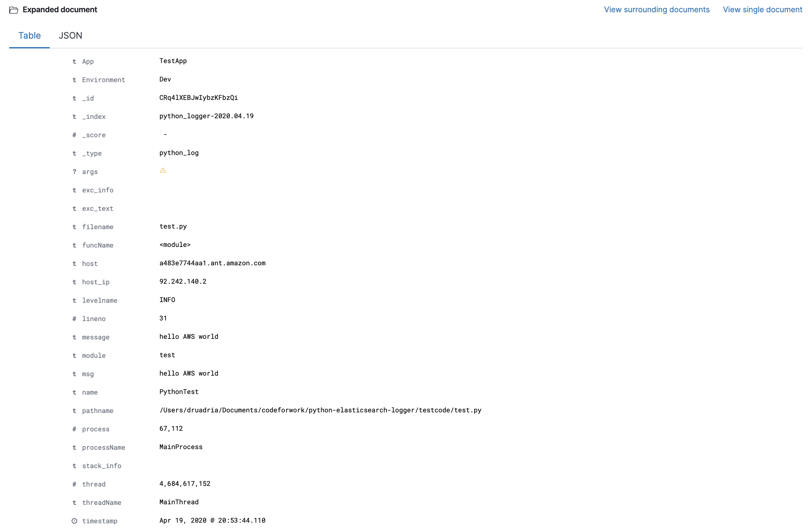

===============
CMRESHandler.py
===============

|  |license| |versions| |status| |downloads|

Python Elasticsearch Log handler 2
**********************************

This library provides an Elasticsearch logging appender compatible with the
python standard `logging <https://docs.python.org/2/library/logging.html>`_ library.

The code source is in github at `https://github.com/drumadrian/python-elasticsearch-logger
<https://github.com/drumadrian/python-elasticsearch-logger>`_

This library is a fork from `https://github.com/cmanaha/python-elasticsearch-logger
<https://github.com/cmanaha/python-elasticsearch-logger>`_

The fork was intened to add a session token for usage in AWS with non permanent credentials. 

The AWS Security Token Service (STS) is a web service that enables you to request temporary, limited-privilege
credentials for AWS Identity and Access Management (IAM) users or for users that you 
authenticate (federated users). 

Installation
============
Install using pip::

    pip install CMRESHandler2

Requirements Python 2
=====================
This library requires the following dependencies
 - elasticsearch
 - requests
 - enum

Requirements Python 3
=====================
This library requires the following dependencies
 - elasticsearch
 - requests

Additional requirements for Kerberos support
============================================
Additionally, the package support optionally kerberos authentication by adding the following dependecy
 - requests-kerberos

Additional requirements for AWS IAM user authentication (request signing)
=========================================================================
Additionally, the package support optionally AWS IAM user authentication by adding the following dependecy
 - requests-aws4auth

Using the handler in  your program
==================================
To initialise and create the handler, just add the handler to your logger as follow ::

    import logging
    from cmreslogging.handlers import CMRESHandler
    handler = CMRESHandler(hosts=[{'host': 'localhost', 'port': 9200}],
                               auth_type=CMRESHandler.AuthType.NO_AUTH,
                               es_index_name="my_python_index")
    log = logging.getLogger("PythonTest")
    log.setLevel(logging.INFO)
    log.addHandler(handler)

You can add fields upon initialisation, providing more data of the execution context ::

    import logging
    from cmreslogging.handlers import CMRESHandler
    handler = CMRESHandler(hosts=[{'host': 'localhost', 'port': 9200}],
                               auth_type=CMRESHandler.AuthType.NO_AUTH,
                               es_index_name="my_python_index",
                               es_additional_fields={'App': 'MyAppName', 'Environment': 'Dev'})
    log = logging.getLogger("PythonTest")
    log.setLevel(logging.INFO)
    log.addHandler(handler)

This additional fields will be applied to all logging fields and recorded in elasticsearch

To log, use the regular commands from the logging library ::

    log.info("This is an info statement that will be logged into elasticsearch")

Your code can also dump additional extra fields on a per log basis that can be used to instrument
operations. For example, when reading information from a database you could do something like::

    start_time = time.time()
    database_operation()
    db_delta = time.time() - start_time
    log.debug("DB operation took %.3f seconds" % db_delta, extra={'db_execution_time': db_delta})

The code above executes the DB operation, measures the time it took and logs an entry that contains
in the message the time the operation took as string and for convenience, it creates another field
called db_execution_time with a float that can be used to plot the time this operations are taking using
Kibana on top of elasticsearch

Initialisation parameters
=========================
The constructors takes the following parameters:
 - hosts:  The list of hosts that elasticsearch clients will connect, multiple hosts are allowed, for example ::

    [{'host':'host1','port':9200}, {'host':'host2','port':9200}]

 - auth_type: The authentication currently support CMRESHandler.AuthType = NO_AUTH, BASIC_AUTH, KERBEROS_AUTH
 - auth_details: When CMRESHandler.AuthType.BASIC_AUTH is used this argument must contain a tuple of string with the user and password that will be used to authenticate against the Elasticsearch servers, for example ('User','Password')
 - aws_access_key: When ``CMRESHandler.AuthType.AWS_SIGNED_AUTH`` is used this argument must contain the AWS key id of the  the AWS IAM user
 - aws_secret_key: When ``CMRESHandler.AuthType.AWS_SIGNED_AUTH`` is used this argument must contain the AWS secret key of the  the AWS IAM user
 - aws_session_token: When ``CMRESHandler.AuthType.AWS_SIGNED_AUTH`` is used this argument must contain the AWS session token of the  the AWS IAM user
 - aws_region: When ``CMRESHandler.AuthType.AWS_SIGNED_AUTH`` is used this argument must contain the AWS region of the  the AWS Elasticsearch servers, for example ``'us-east'``
 - use_ssl: A boolean that defines if the communications should use SSL encrypted communication
 - verify_ssl: A boolean that defines if the SSL certificates are validated or not
 - buffer_size: An int, Once this size is reached on the internal buffer results are flushed into ES
 - flush_frequency_in_sec: A float representing how often and when the buffer will be flushed
 - es_index_name: A string with the prefix of the elasticsearch index that will be created. Note a date with
   YYYY.MM.dd, ``python_logger`` used by default
 - index_name_frequency: The frequency to use as part of the index naming. Currently supports
   CMRESHandler.IndexNameFrequency.DAILY, CMRESHandler.IndexNameFrequency.WEEKLY,
   CMRESHandler.IndexNameFrequency.MONTHLY, CMRESHandler.IndexNameFrequency.YEARLY by default the daily rotation
   is used
 - es_doc_type: A string with the name of the document type that will be used ``python_log`` used by default
 - es_additional_fields: A dictionary with all the additional fields that you would like to add to the logs

Using the handler in  your program with AWS Credentials
==================================
To initialise and create the handler, just add the handler to your logger as follow ::
        
    from cmreslogging.handlers import CMRESHandler
    import logging
    import os
    import sys

    AWS_ACCESS_KEY_ID=os.environ['AWS_ACCESS_KEY_ID']
    AWS_SECRET_ACCESS_KEY=os.environ['AWS_SECRET_ACCESS_KEY']
    AWS_SESSION_TOKEN=os.environ['AWS_SESSION_TOKEN']
    AWS_REGION='us-west-2'
    HOSTS=[{'host': 'search-serverl-elasti-krvvhs1lejpx-nq56g4vhirhbcjq8tticudbpfi.us-west-2.es.amazonaws.com', 'port': 443}]

    handler = CMRESHandler( hosts=HOSTS,
                            auth_type=CMRESHandler.AuthType.AWS_SIGNED_AUTH,
                            aws_access_key=AWS_ACCESS_KEY_ID,
                            aws_secret_key=AWS_SECRET_ACCESS_KEY,
                            aws_session_token=AWS_SESSION_TOKEN,
                            aws_region=AWS_REGION,
                            use_ssl=True,
                            verify_ssl=True,
                            es_additional_fields={'App': 'TestApp', 'Environment': 'Dev'},
                            es_index_name="python_logger")

    log = logging.getLogger("PythonTest")
    log.setLevel(logging.INFO)
    log.addHandler(handler)

    logging.basicConfig(stream=sys.stdout, level=logging.DEBUG)

    print("hello world")
    log.debug("hello stdout world")
    log.info("hello AWS world")

Django Integration
==================
It is also very easy to integrate the handler to `Django <https://www.djangoproject.com/>`_ And what is even
better, at DEBUG level django logs information such as how long it takes for DB connections to return so
they can be plotted on Kibana, or the SQL statements that Django executed. ::

    from cmreslogging.handlers import CMRESHandler
    LOGGING = {
        'version': 1,
        'disable_existing_loggers': False,
        'handlers': {
            'file': {
                'level': 'DEBUG',
                'class': 'logging.handlers.RotatingFileHandler',
                'filename': './debug.log',
                'maxBytes': 102400,
                'backupCount': 5,
            },
            'elasticsearch': {
                'level': 'DEBUG',
                'class': 'cmreslogging.handlers.CMRESHandler',
                'hosts': [{'host': 'localhost', 'port': 9200}],
                'es_index_name': 'my_python_app',
                'es_additional_fields': {'App': 'Test', 'Environment': 'Dev'},
                'auth_type': CMRESHandler.AuthType.NO_AUTH,
                'use_ssl': False,
            },
        },
        'loggers': {
            'django': {
                'handlers': ['file','elasticsearch'],
                'level': 'DEBUG',
                'propagate': True,
            },
        },
    }

There is more information about how Django logging works in the
`Django documentation <https://docs.djangoproject.com/en/1.9/topics/logging//>`_

Building the sources & Testing
------------------------------
To create the package follow the standard python setup.py to compile.
To test, just execute the python tests within the test folder

Why using an appender rather than logstash or beats
---------------------------------------------------
In some cases is quite useful to provide all the information available within the LogRecords as it contains
things such as exception information, the method, file, log line where the log was generated.

If you are interested on understanding more about the differences between the agent vs handler
approach, I'd suggest reading `this conversation thread <https://github.com/cmanaha/python-elasticsearch-logger/issues/44/>`_

The same functionality can be implemented in many other different ways. For example, consider the integration
using `SysLogHandler <https://docs.python.org/3/library/logging.handlers.html#sysloghandler>`_ and
`logstash syslog plugin <https://www.elastic.co/guide/en/logstash/current/plugins-inputs-syslog.html>`_.

Kibana Screenshot
-----------------

Contributing back
-----------------
Feel free to use this as is or even better, feel free to fork and send your pull requests over.

.. |downloads| image:: https://img.shields.io/pypi/dd/CMRESHandler2.svg
    :target: https://pypi.python.org/pypi/CMRESHandler2
    :alt: Daily PyPI downloads
.. |versions| image:: https://img.shields.io/pypi/pyversions/CMRESHandler2.svg
    :target: https://pypi.python.org/pypi/CMRESHandler2
    :alt: Python versions supported
.. |status| image:: https://img.shields.io/pypi/status/CMRESHandler2.svg
    :target: https://pypi.python.org/pypi/CMRESHandler2
    :alt: Package stability
.. |license| image:: https://img.shields.io/pypi/l/CMRESHandler2.svg
    :target: https://pypi.python.org/pypi/CMRESHandler2
    :alt: License
